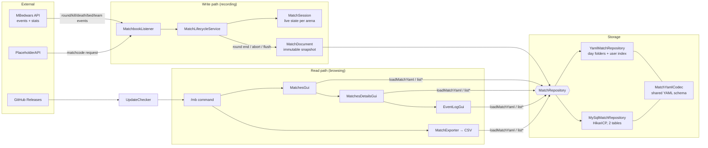
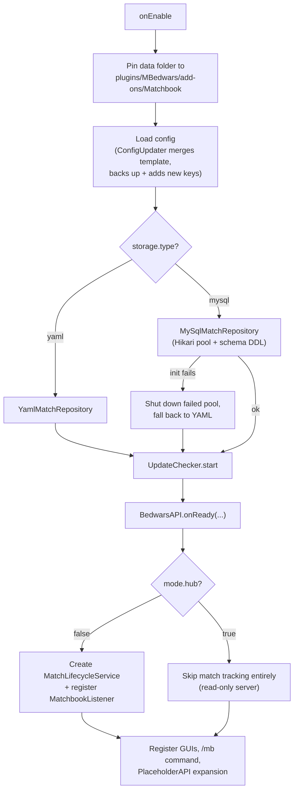
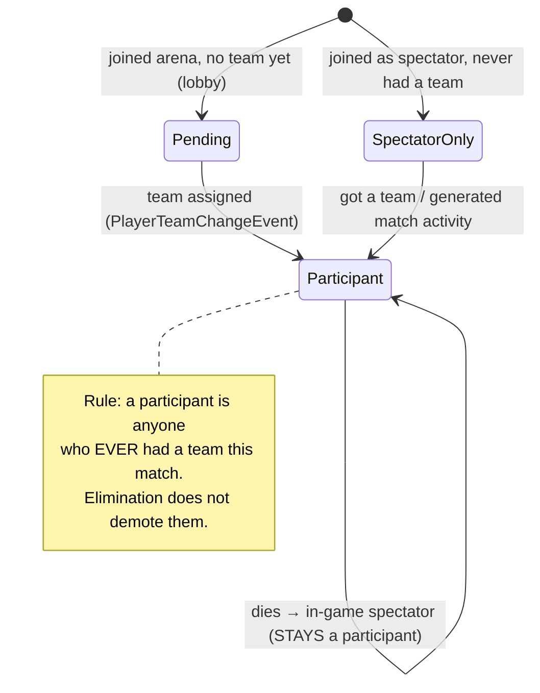
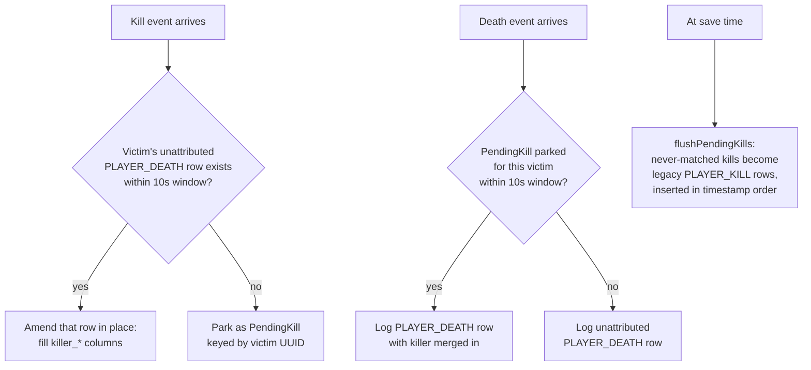
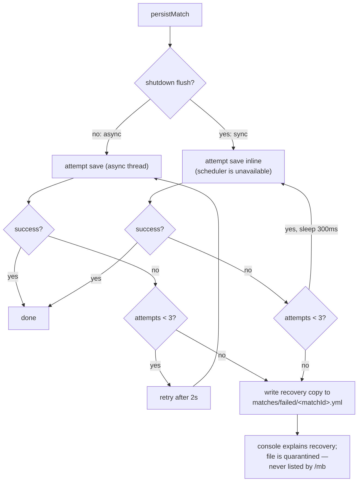

# Matchbook

A Paper plugin that records persistent match history for [MBedwars](https://www.spigotmc.org/resources/mbedwars.82729/). Browse past matches in-game, export stats to CSV, and view a full event-by-event match timeline.

---

## Features

- **Match history** — every completed BedWars match is saved with per-player stats (kills, deaths, final kills, beds destroyed, wins, losses).
- **Event log** — every join, leave, death, kill, bed break, and team elimination is recorded with timestamps, including the death/kill cause (fall, void, entity attack, etc.) and whether a leaving player was already eliminated and spectating. Viewable in the GUI and exportable to CSV.
- **Placement tracking** — 1st, 2nd, 3rd place tracked per team and included in exports. Final standings are always a contiguous 1..N ranking, so a match can never record a 1st, 3rd and 4th with no 2nd. Teams tied for 1st get a dedicated tie stat instead of a false 1st-place credit.
- **Tie detection** — matches that end without a winner are correctly flagged as ties, with the specific tied teams tracked and shown by color.
- **In-game GUI** — paginated match list, detailed per-player stats, event timeline viewer.
- **CSV export** — player stats and event log exported as separate CSV files.
- **PlaceholderAPI** — exposes `%matchbook_matchcode%` for scoreboards/holograms.
- **Dual storage** — flat YAML files (default) or MySQL/MariaDB with one-command migration.
- **Auto config updates** — on plugin upgrade, new config keys are added automatically while preserving your existing settings.
- **Built for reliability** — saves retry and fall back to a local recovery file if storage is down; duplicate round-end events, back-to-back arena restarts, quick leave/rejoins, and mid-match team changes are all handled without corrupting records. A match's roster is taken from MBedwars' own round-end winner/loser lists (not live arena occupancy), and per-player stats are diffed against a baseline captured when they joined — so a player who's already queued into the arena's next round can't leak into the previous one with stats they didn't earn. The match lifecycle is covered by a simulation harness that replays these edge cases against the real code.
- **Proxy/network safe** — on a hub server with no arenas of its own, Matchbook won't create match records for arenas MBedwars merely knows about over the network (via its remote-arena awareness); it only tracks arenas actually running on that server.
- **Hub/lobby mode** — an explicit `mode.hub` config flag to fully disable match recording on a server, while still reading and exporting matches from the shared storage backend.

---

## Requirements

| Dependency | Version | Required |
|---|---|---|
| [Paper](https://papermc.io/) | 1.21+ | ✅ |
| [MBedwars](https://www.spigotmc.org/resources/mbedwars.82729/) | 5.x | ✅ |
| [PlaceholderAPI](https://www.spigotmc.org/resources/placeholderapi.6245/) | 2.11+ | Optional |

---

## Installation

1. Drop `Matchbook-<version>.jar` into your `plugins/MBedwars/add-ons/` folder.
2. Restart the server. Matchbook creates its config at:
   `plugins/MBedwars/add-ons/Matchbook/config.yml`
3. Edit `config.yml` as needed (see [Configuration](#configuration)).
4. Reload with `/mb reload` or restart.

---

## Commands

All commands use `/matchbook` or the alias `/mb`.

| Command | Permission | Description |
|---|---|---|
| `/mb help` | `mb.command.help` | Show available commands. |
| `/mb matches` | `mb.command.matches` | Open your personal match history GUI. |
| `/mb all` | `mb.command.all` | Open the global match list (all matches, newest first). |
| `/mb view <matchcode>` | `mb.command.view` | Open the details GUI for a specific match. |
| `/mb export <code>[,code...]` | `mb.command.export` | Export one or more matches to CSV files. |
| `/mb migrate yaml2mysql` | `mb.command.migrate` | Migrate all YAML match files into MySQL. |
| `/mb migrate mysql2yaml` | `mb.command.migrate` | Migrate all MySQL records to YAML files. |
| `/mb migrate ... --dry-run` | `mb.command.migrate` | Preview migration without writing anything. |
| `/mb reload` | `mb.command.reload` | Reload `config.yml` without restarting — hot-swaps the storage backend too if `storage.*` changed. |
| `/mb statskeys [player]` | `mb.command.statskeys` | List all stat keys available from MBedwars for a player. |
| `/mb test` | `mb.command.test` | Run a storage health check. |

---

## Permissions

### Permission Groups

| Node | Default | Grants |
|---|---|---|
| `mb.command.use` | Everyone | Required to use any `/mb` command at all. |
| `mb.command.default` | Everyone | `matches`, `all`, `view`, `export`, `help` |
| `mb.command.admin` | OP | `migrate`, `reload`, `statskeys`, `test` |

### Individual Nodes

| Node | Default |
|---|---|
| `mb.command.matches` | false |
| `mb.command.all` | false |
| `mb.command.view` | false |
| `mb.command.export` | false |
| `mb.command.help` | false |
| `mb.command.migrate` | false |
| `mb.command.reload` | false |
| `mb.command.statskeys` | false |
| `mb.command.test` | false |

> **Tip:** Grant `mb.command.default` to your player rank and `mb.command.admin` to staff. The `mb.command.use` node is true by default so everyone can run `/mb` without a permission error.

### Legacy nodes

These are kept for backwards compatibility with older permission setups:

- `matchbook.admin` — equivalent to `mb.command.admin`
- `matchbook.matches` — equivalent to `mb.command.matches`
- `matchbook.migrate` — equivalent to `mb.command.migrate`

---

## In-Game GUI

### Match History (`/mb matches`)

- Shows all of your past matches, most recent first.
- Each item shows the actual result: the winning team's color and name (e.g. **RED WIN**), or every tied team's color for a tie (e.g. **RED, BLUE TIE**). Your own team for that match is shown in the item tooltip.
- Displays your stats for that match in the item tooltip.
- Click any match to open Match Details.

### Match Details

- Players are grouped by team (fixed color order), then sorted by final kills → kills within each team.
- Each player is shown as a wool block colored by their team's actual bed color.
- Row 1 holds the match summary; the player list starts on row 2.
- **Spectators** are listed in the spyglass item (slot 47 in the nav bar).
- **Event Log button** (slot 51) — click to open the full event timeline.
- Prev/Next navigate between pages when there are many players.

### Event Log

- Paginated timeline of every event that occurred during the match.
- Each event is its own inventory item with an icon, description, and time offset.
- Time is shown as `+M:SS` from match start. Events before the round began show as `lobby`.
- Navigate with Prev/Next; click Back to return to Match Details.

**Event types displayed:**

| Icon | Event |
|---|---|
| Lime glass pane | Match started (shows real wall-clock time) |
| Red glass pane | Match ended (shows duration) |
| Lime dye | Player joined |
| Red dye | Player left (still an active player) |
| Gray dye | Player left while spectating (already eliminated) |
| Skeleton skull | Regular death (shows cause when available, e.g. Fall, Void, Entity Attack) |
| Wither skeleton skull | Final death / eliminated (shows cause when available) |
| Iron sword | Regular kill (shows cause when available) |
| Golden sword | Final kill (shows cause when available) |
| TNT | Bed destroyed |
| Barrier | Team eliminated |
| Spyglass | Spectator joined |
| Ender eye | Spectator left |

---

## CSV Export

Running `/mb export <matchcode>` creates two files in `plugins/MBedwars/add-ons/Matchbook/exports/`:

### `<matchcode>.csv` — Player Stats

One row per participant with their stat diffs for that match.

```csv
# match_codes: 8F3KQ-2JDXW
# matchbook_version: 0.7.3
uuid,username,team,kills,final_kills,deaths,final_deaths,beds_destroyed,wins,loses
...
```

### `<matchcode>_events.csv` — Event Log

One row per event in chronological order.

```csv
# match: 8F3KQ-2JDXW
# matchbook_version: 0.7.3
offset_seconds,wall_clock_unix,type,player_name,player_uuid,player_team,killer_name,killer_uuid,killer_team,bed_team,final,cause,was_spectating,kill_cause
0,1751234567,MATCH_START,,,,,,,,false,,false,
13,1751234580,PLAYER_JOIN,Steve,<uuid>,RED,,,,,false,,false,
58,1751234625,PLAYER_DEATH,Alex,<uuid>,BLUE,Steve,<uuid>,RED,,true,VOID,false,ENTITY_ATTACK
...
```

`matchbook_version` is the Matchbook version that **recorded** the match (captured when the match session was created and stored with the match), not the version doing the export. Matches recorded before 0.6.10 show `unknown`. Multi-match exports print `# matchbook_versions:` instead — a single value when all matches were recorded by the same build, otherwise `code=version` pairs.

A `PLAYER_DEATH` row is the complete record of one death: the victim (`player_*`), how they died (`cause` — the Bukkit damage cause, e.g. `FALL`, `VOID`, `ENTITY_ATTACK`, `PROJECTILE`), and the responsible player MBedwars credited (`killer_*`). `kill_cause` shows how that player contributed — the example row above reads "Alex fell into the void after being hit by Steve, and it was a final kill". Empty killer columns on a void/fall death mean nobody was credited: a genuine environmental death. `was_spectating` is `true` on a `PLAYER_LEAVE` row when the player had already been eliminated and was spectating at the moment they left.

Matches recorded before 0.7.0 log attribution as a separate `PLAYER_KILL` row (killer in `killer_*`, victim name in `player_name`, kill cause in `cause`) near the victim's `PLAYER_DEATH` row. Those matches export and display exactly as before, and `PLAYER_KILL` can still appear (rarely) in new recordings when a kill couldn't be matched to its death row.

For multi-match exports, the events CSV includes an extra `match` column at the start and is sorted chronologically across all matches.

---

## Configuration

Config lives at `plugins/MBedwars/add-ons/Matchbook/config.yml`.

On plugin update, Matchbook automatically backs up your config (`config.yml.bak-<old-version>-<date>`) and merges new settings in. You never need to re-configure from scratch.

### Hub / Lobby Mode

```yaml
mode:
  hub: false   # set true on a server that should never record matches
```

When `mode.hub` is `true`, Matchbook registers no match-tracking listeners at all — it never creates a match session or writes a match to storage on that server. It still connects to the configured storage backend, so `/mb matches`, `/mb all`, `/mb view`, and `/mb export` keep working for browsing/exporting matches recorded elsewhere. This is meant for a hub/lobby server pointed at the same shared MySQL database as your backend arena servers (`storage.type: mysql`). Takes effect on server start/restart, not `/mb reload`.

### Storage

```yaml
storage:
  type: yaml          # yaml or mysql
  mysql:
    host: "127.0.0.1"
    port: 3306
    database: "matchbook"
    username: "matchbook"
    password: "change_me"
    table_prefix: "matchbook_"
```

Changing anything under `storage:` (including switching `type` between `yaml` and `mysql`) takes effect on `/mb reload` — no server restart needed. Matchbook builds and validates the new backend (connects, runs a health check) *before* switching over, so a typo'd password or unreachable host just fails the reload and logs why, leaving the previous backend running untouched. (`mode.hub` is the one exception — it still needs a restart, see [Hub / Lobby Mode](#hub--lobby-mode).)

If a match ever can't be saved after a few retries (e.g. the database is briefly unreachable), Matchbook writes a local recovery copy to `matches/failed/<matchcode>.yml` instead of losing it — nothing to do at the time, just move/re-import that file once storage is healthy again.

`matches/failed/` is quarantine, not storage: recovery copies are deliberately **not** listed by `/mb all` or openable with `/mb view`, so a record the backend rejected can never be mistaken for one that saved cleanly. To bring one back, move it into a day folder under `matches/` (YAML mode) or import it (MySQL mode).

### Tracked Stats

```yaml
match:
  tracked_keys:
    - "bedwars:kills"
    - "bedwars:final_kills"
    # ... add more using keys from /mb statskeys
```

### Export Columns

```yaml
export:
  columns:
    - uuid
    - username
    - team
    - bedwars:kills
    - bedwars:final_kills
    # Leave empty to use all tracked_keys as defaults
```

---

## MySQL Setup

1. Create a database and user:
   ```sql
   CREATE DATABASE matchbook CHARACTER SET utf8mb4 COLLATE utf8mb4_unicode_ci;
   CREATE USER 'matchbook'@'localhost' IDENTIFIED BY 'your_password';
   GRANT ALL PRIVILEGES ON matchbook.* TO 'matchbook'@'localhost';
   ```
2. Set `storage.type: mysql` in `config.yml` with your credentials.
3. Restart the server — tables are created automatically.

> **TLS:** connections verify the server certificate by default. If your MySQL/MariaDB server uses a self-signed certificate, add `verifyServerCertificate=false` to `mysql.params` in `config.yml`.

### Migration

Migrate existing YAML data to MySQL (or back) without losing anything:

```
# Preview what would be migrated
/mb migrate yaml2mysql --dry-run

# Perform the migration
/mb migrate yaml2mysql

# Reverse: move MySQL data back to YAML
/mb migrate mysql2yaml
```

---

## PlaceholderAPI

If PlaceholderAPI is installed, Matchbook registers the `%matchbook_matchcode%` placeholder. It returns the current active match code for the player's arena (or their last match code for a short grace period after the match ends, so scoreboards don't go blank during transitions).

---

## Multi-Server / Proxy Networks

MBedwars has its own network-wide arena awareness (so hub servers behind a proxy can show live info for arenas hosted on other backend servers). Matchbook only ever creates a match record for an arena that has an actual game world loaded on that specific server — so installing Matchbook on a hub server with no arenas of its own is safe: it will never start tracking (and getting stuck on) matches that are really being played elsewhere on the network. If it ever rejects an arena for this reason, it logs one warning per arena name so you can confirm what happened.

For a hub server, prefer setting `mode.hub: true` explicitly (see [Hub / Lobby Mode](#hub--lobby-mode)) rather than relying solely on the automatic arena-locality check above — it skips match tracking entirely instead of rejecting arenas one at a time, and makes the server's role unambiguous.

If you run YAML storage per-server, each server's match history stays local to it. Point every server at the same MySQL database (`storage.type: mysql`) if you want one shared, network-wide match history instead — this is required for a hub server in `mode.hub: true` to have anything to read/export.

---

## Storage Layout (YAML mode)

```
plugins/MBedwars/add-ons/Matchbook/
├── config.yml
├── matches/
│   ├── 06-30-2026/                      ← one folder per day (MM-dd-yyyy)
│   │   ├── 1751297443-a1b2c3…-8F3KQ-2JDXW.yml  ← <startUnix>-<arenaHash>-<matchcode>.yml
│   │   └── 1751299018-a1b2c3…-M7G9V-QDQ9T.yml
│   ├── failed/                          ← quarantined recovery copies (not listed by /mb)
│   └── ...
├── users/
│   └── <player-uuid>.yml    ← per-player match index
└── exports/
    ├── 8F3KQ-2JDXW.csv
    └── 8F3KQ-2JDXW_events.csv
```

Each match file is a self-contained YAML document with the match summary, per-player stats, and the full event log.

---

## Building from Source

```bash
./gradlew shadowJar
```

Output: `build/libs/Matchbook-<version>.jar`

Requires Java 21+.

---

# Developer Manual — Architecture & Internals

Everything below is about **how Matchbook is built and how it works internally**. It's written so the plugin can be understood without reading the code.

## Table of Contents

1. [How it's built](#1-how-its-built)
2. [Project layout](#2-project-layout)
3. [High-level architecture](#3-high-level-architecture)
4. [Startup sequence](#4-startup-sequence)
5. [The match lifecycle (the core)](#5-the-match-lifecycle-the-core)
6. [The stats pipeline](#6-the-stats-pipeline)
7. [Placement & result resolution](#7-placement--result-resolution)
8. [The event log & kill/death merging](#8-the-event-log--killdeath-merging)
9. [Persistence layer](#9-persistence-layer)
10. [The match document schema](#10-the-match-document-schema)
11. [The GUIs](#11-the-guis)
12. [Commands & tab completion internals](#12-commands--tab-completion-internals)
13. [Supporting services](#13-supporting-services)
14. [Threading & reliability model](#14-threading--reliability-model)

---

## 1. How it's built

Matchbook is a single-module **Gradle** project targeting **Java 21** (via toolchain), built with the **Shadow plugin** so the final jar is self-contained.

| Dependency | Scope | Why |
|---|---|---|
| `io.papermc.paper:paper-api` 1.21.4 | `compileOnly` | Provided by the server at runtime |
| `de.marcely.bedwars:API` 5.5.6 | `compileOnly` | Provided by the MBedwars plugin (hard `depend`) |
| `me.clip:placeholderapi` 2.11.6 | `compileOnly` | Optional (`softdepend`); guarded by a plugin-presence check |
| `com.zaxxer:HikariCP` 5.1.0 | `implementation` | **Shaded** into the jar — connection pooling for MySQL |
| `com.mysql:mysql-connector-j` 9.0.0 | `implementation` | **Shaded** into the jar — JDBC driver |

Two deliberate build quirks:

- **The plain `jar` task is disabled.** It would produce a "thin" jar without HikariCP/mysql-connector (they're `implementation`-scoped, only shadowJar bundles them) that throws `NoClassDefFoundError` the moment MySQL storage is enabled. Worse, both tasks write to the same `build/libs/Matchbook-<version>.jar` (shadowJar's classifier is `""`), so leaving `jar` enabled was a race that could silently overwrite the working shaded jar with the broken thin one. `assemble`/`build` now only produce the shaded jar.
- **Dependencies are not relocated.** Relocation is deliberately off to avoid surprises with the JDBC service-provider (SPI) discovery mechanism.

There is no test source set in the repo; the README's "simulation harness" for the match lifecycle lives outside this module.

## 2. Project layout

```
Matchbook/
├── build.gradle / settings.gradle / gradlew        ← Gradle build (Shadow plugin, Java 21)
├── src/main/resources/
│   ├── plugin.yml                                  ← Bukkit descriptor, commands, permission tree
│   └── config.yml                                  ← packaged config template (also the merge source
│                                                      for automatic config upgrades)
└── src/main/java/com/slg/matchbook/
    ├── MatchbookPlugin.java        ← JavaPlugin entry point; wiring, storage bootstrap, reload/hot-swap
    ├── MatchbookListener.java      ← bridges MBedwars events → MatchLifecycleService
    ├── MatchSession.java           ← all live state for one in-progress match
    ├── StatSnapshot.java           ← immutable map of stat key → value, with diff()
    ├── MatchStorage.java           ← YAML file writer (day folders, filenames, user index updates)
    ├── UserMatchIndex.java         ← per-player users/<uuid>.yml history index (file-locked)
    ├── model/
    │   ├── MatchDocument.java      ← immutable, storage-ready snapshot of a finished match
    │   └── MatchEvent.java         ← one timeline event (record + factory methods)
    ├── service/
    │   ├── MatchLifecycleService.java ← THE core: session lifecycle, stats capture, placements, saving
    │   ├── BedwarsStatsAdapter.java   ← normalizes MBedwars' stats object across API versions
    │   └── UpdateChecker.java         ← GitHub release polling + operator alerts
    ├── storage/
    │   ├── MatchRepository.java       ← backend interface (save/load/list/health)
    │   ├── YamlMatchRepository.java   ← flat-file backend
    │   ├── MySqlMatchRepository.java  ← HikariCP/MySQL backend
    │   ├── MigrationService.java      ← yaml2mysql / mysql2yaml (with --dry-run)
    │   └── HealthCheckResult.java     ← ok/fail + message record
    ├── io/
    │   ├── MatchYamlCodec.java        ← single source of truth for the match YAML schema
    │   ├── MatchExporter.java         ← CSV export (stats + events, single & combined)
    │   └── HasteUploader.java         ← Hastebin-compatible upload client (currently disabled at call sites)
    ├── config/
    │   ├── MatchbookConfig.java       ← config loading + typed accessors
    │   ├── ConfigUpdater.java         ← template merge / comment restore / backups on upgrade
    │   ├── RuntimeSettings.java       ← immutable parsed settings, swapped atomically on reload
    │   └── StorageType.java           ← YAML | MYSQL
    ├── commands/
    │   └── MatchbookCommand.java      ← /mb executor + tab completer (async storage access)
    ├── gui/
    │   ├── MatchesGui.java            ← match list (history + all), 54-slot paginated
    │   ├── MatchesDetailsGui.java     ← per-match player breakdown
    │   └── EventLogGui.java           ← per-match event timeline
    ├── placeholders/
    │   └── MatchbookExpansion.java    ← %matchbook_matchcode% (PlaceholderAPI)
    └── util/
        ├── MatchIdUtil.java           ← random Crockford-Base32 match codes ("8F3KQ-2JDXW")
        └── StatsKeyDiscovery.java     ← reflective stat-key enumeration for /mb statskeys
```

A useful mental split: **recording** (listener → lifecycle → session → document → repository) is the write path; **browsing/exporting** (command → repository → GUI/exporter) is the read path. The two only meet at the `MatchRepository` interface and the YAML document schema.

## 3. High-level architecture



Key architectural decisions:

- **One YAML schema everywhere.** `MatchYamlCodec` produces the match document; YAML mode writes it as a file, MySQL mode stores the *same YAML text* in a `LONGTEXT` column. The GUIs and exporter read a `YamlConfiguration` regardless of backend, so they contain zero storage branching, and migration between backends is a straight copy.
- **Sessions are decoupled from documents.** `MatchSession` is mutable, concurrent, and full of live MBedwars object references. `MatchDocument` is an immutable snapshot with no live references, safe to serialize on any thread.
- **The listener is thin.** `MatchbookListener` only translates MBedwars events into lifecycle calls (plus main-thread bouncing for async events); every decision lives in `MatchLifecycleService`.

## 4. Startup sequence



Notable details:

- **The data folder is hard-pinned** to `plugins/MBedwars/add-ons/Matchbook` (resolved from the server's plugins folder) rather than the default per-plugin folder — Matchbook lives as an MBedwars add-on.
- **Almost everything waits for `BedwarsAPI.onReady`** so MBedwars is fully initialized before listeners and GUIs exist. The only things registered unconditionally are the update checker and its join-notification listener (they must work in hub mode too).
- **Storage init is failure-tolerant:** if MySQL init throws, the half-built pool is explicitly shut down (so it can't leak connections) and Matchbook falls back to YAML rather than disabling itself.
- **Shutdown (`onDisable`)** flushes all in-progress sessions *synchronously* before closing the repository — Bukkit refuses new async tasks once a plugin is marked disabled, so the async save path would silently drop matches at that point.

## 5. The match lifecycle (the core)

`MatchLifecycleService` owns a map of **one live `MatchSession` per arena name** (`sessionsByArena`). The session is where every piece of live match state accumulates: participants, teams, alive-tracking, stat baselines, counters, and the event log.

### Session creation & identity

- A session can be created **early** (first player joins the arena lobby, or a placeholder resolves) so `%matchbook_matchcode%` is stable before the round starts. Its `startUnix` is overwritten when `RoundStartEvent` actually fires; `started=true` from then on gates event logging (no lobby join/leave noise).
- Match codes come from `MatchIdUtil`: two 5-character groups of Crockford Base32 (no I/L/O/U) from `SecureRandom` — e.g. `8F3KQ-2JDXW`, a 32¹⁰ (~10¹⁵) space. IDs are random and never checked for uniqueness at allocation; the MySQL backend has a collision guard as backstop (§9).
- `liveSessionOrNew()` never returns a session whose `endUnix` is set — an ended session still waiting on its save chain is evicted and a fresh one created, so a fast next round on the same arena can't get merged into the previous match.
- `isLocallyHosted()` rejects arenas with no loaded game world on this server — MBedwars' proxy-wide "remote arena" awareness would otherwise let a hub server create phantom sessions for matches actually played elsewhere.

### Player classification

Every player in an arena is in exactly one of three states per match, and the transitions matter because only **participants** get stats and appear in the record:



Classification at join time is **deferred by `join_classify_delay_ticks`** (default 60): MBedwars can report stale team/spectator state in the seconds right after a round starts, which would misclassify a real player as a spectator or vice versa. The `SpectatorJoinArenaEvent` reason is also used: `LOSE`/`DEATH` mean an eliminated *participant* became an in-game spectator (ignored), anything else is an external viewer (marked spectator-only).

### Life of a match

```mermaid
sequenceDiagram
    participant MB as MBedwars
    participant L as Listener
    participant LS as LifecycleService
    participant S as MatchSession
    participant R as MatchRepository

    MB->>L: RoundStartEvent
    L->>LS: onRoundStart
    LS->>S: startUnix = now, started = true, MATCH_START event
    LS->>LS: schedule start snapshots (audit)<br/>+ abort watchdog (1s timer)
    LS->>S: (after classify delay) capture roster,<br/>freeze totalTeams, capture stat baselines

    loop During the match
        MB->>L: kill / death / bed break / team eliminate / join / quit
        L->>LS: handler (pinned session; async events bounced to main thread)
        LS->>S: trigger counters, event log rows,<br/>alive-tracking, live elimination placement
    end

    MB->>L: RoundEndEvent (winners, losers, quit memories)
    L->>LS: onRoundEnd
    LS->>S: endUnix = now (dedupes duplicate RoundEnds)
    LS->>S: roster := RoundEndEvent lists (NOT live arena occupancy)
    Note over LS: after end_snapshot_delay_ticks…
    LS->>LS: end snapshots → per-match stats capture →<br/>apply trigger counters → finalize placements →<br/>infer result → normalize ranks → reconcile ties →<br/>bake placements into stats
    LS->>S: MATCH_END event, remove session from map
    LS->>R: persistMatch(MatchDocument) — async, retried
```

Three details here are load-bearing:

- **Session pinning.** MBedwars can fire kills/deaths/bed breaks asynchronously; the listener must bounce them to the main thread, which lands a tick later. The listener therefore *pins* the live session at the moment the event fires (`pinLiveSession`). Without this, the match-deciding final kill would re-resolve the session after `RoundEnd` already stamped `endUnix` and be silently discarded.
- **The round-end roster comes from `RoundEndEvent`,** not `arena.getPlayers()`. Live occupancy can already include players queued into the arena's *next* round; the event's winner/loser lists (plus `QuitPlayerMemory` for players who left) are exactly who played *this* round.
- **The ended-session guard.** Once `endUnix` is set, `liveSession()` returns null for that arena — straggler events during the multi-second save chain belong to whatever comes next, not the closing match.

### Abort & flush paths

A 1-second watchdog per match handles the cases where `RoundEnd` never arrives:

- **Stuck match:** running longer than `match.max_duration_minutes` (default 180) with no round end → **discarded**, never saved. This is the fix for the historical "duplicate match with an absurd running time" bug (a lingering session being flushed at server shutdown with a start time from hours earlier).
- **Aborted match:** arena leaves `RUNNING` without a `RoundEnd` → best-effort stats capture, saved with result `ABORTED` (only if it has real activity).
- **Plugin disable:** `flushAll(sync=true)` saves every remaining session synchronously (result `ABORTED` unless already determined). The same max-duration check applies at persist time as a second line of defense, and negative durations are always rejected.

A match is **only persisted at all** if it has real activity: at least one kill, final kill, death, final death, or bed break (event-driven flag first, document inspection as fallback).

## 6. The stats pipeline

Per-player match stats are the hardest part of the plugin, because MBedwars updates its counters on its own schedule and players can hop between matches. Matchbook uses **three independent sources**, merged in priority order:

| Priority | Source | When captured | Notes |
|---|---|---|---|
| 1 | **Per-round "game stats"** (`QuitPlayerMemory.getGameStats()` at quit, or live game stats at round end for players still in the arena) | Quit time / round end | The primary source. Always **diffed against a per-player baseline** (below). |
| 2 | **Event-driven trigger counters** (`bedwars:kills`, `final_kills`, `deaths`, `final_deaths`, `beds_destroyed`) counted directly from MBedwars events | Live, per event | Backstop: `applyTriggerIncrementsToMatchStats` raises any stat that the snapshot sources under-reported. Also the persistence trigger. |
| 3 | **Start/end snapshots of career totals** for every tracked key | `start_snapshot_delay_ticks` after round start / `end_snapshot_delay_ticks` after round end | Audit trail (stored as `start`/`end` in the document) and last-resort diff when no game-stats snapshot exists. |

Two guards make source 1 safe:

- **Baselines.** When a player first becomes a real participant, their current game-stats reading is captured once (`putMatchStatsBaselineIfAbsent`). MBedwars is *supposed* to have reset the per-round counter to zero by then, but the reset is timing-dependent (a player sitting in the same arena's next lobby still holds the previous round's numbers). Final stats are stored as `reading − baseline`, so they're always relative to zero regardless. First capture wins — a rejoin can't reset the baseline.
- **Generation counters.** The quit-time fallback snapshot arrives on an async callback. If the player rejoins before it lands, their stats were invalidated (`removeMatchStats` bumps a generation counter); the stale snapshot only writes if the generation hasn't moved. Otherwise a rejoin would freeze the player's stats at quit-time values forever.

Snapshot collection itself is callback-based (MBedwars stats API is async) with a countdown latch and a **timeout** (`snapshot_timeout_ticks`): a player whose callback never arrives can delay the save, not block it.

Finally, at document-build time (`MatchDocument.fromSession`):

- Negative diffs are clamped to 0 and recorded in `match.warnings` (they indicate MBedwars reset a counter mid-match).
- **Win/loss enforcement** (`enforce_win_loss_from_result`): winners get `wins=1, loses=0`; everyone else `loses=1, wins=0` — from the *match result*, not from whenever MBedwars happened to increment its counters. Tied-for-1st teams get neither (plus `matchbook:ties=1`); in a multi-team match that ended in a tie, teams eliminated earlier still get a loss.

## 7. Placement & result resolution

Placements (1st/2nd/3rd…) are tracked **live** and then repaired at round end by a pipeline of correctors, each handling a specific MBedwars quirk:

**Live tracking during the match**

- `alivePlayersByTeam` tracks who's alive; fatal deaths, quits, and team switches remove players (a switch also re-checks the *old* team for elimination so no "ghost" entry blocks it forever).
- A team is eliminated when its **bed is gone AND all players are dead** (`maybeMarkTeamEliminated`); `TeamEliminateEvent` from MBedwars is the authoritative direct signal. Eliminated teams get a place computed as `totalTeams − eliminationIndex + 1`, floored at 2 (an eliminated team can never be given 1st).
- `totalTeams` is **frozen once** from the roster observed shortly after round start — counting only teams that actually have players, so a lobby-selector team someone abandoned before the round can't inflate the denominator and shift every placement.

**Round-end pipeline (in order, each step feeding the next):**

1. `finalizePlacements` — infer missed bed states via reflection, **drop teams nobody finished on**, detect ties (>1 teams alive with no reported winner), stamp winner as 1st, fill eliminations that were missed live, and assign conservative fallback ranks to ambiguous teams (never falsely rewarding them, never colliding on the same rank).
2. `inferResultFromRecordedWinStats` — some MBedwars builds fire the winning-team event with `null` winner; infer from which team's players have `bedwars:wins` in their per-match stats. Can convert a false TIE into a definitive win (or a real multi-team tie).
3. `normalizePlacements` — collapse to a **contiguous 1..N competition ranking** (order-preserving; genuine ties share a rank, e.g. 1,1,3). This is the backstop that makes standings correct even if the arithmetic drifted — the guarantee behind "never 1st/3rd/4th with no 2nd".
4. `reconcileTieWithPlacements` — a "TIE" whose standings show exactly *one* team at 1st wasn't a tie; promote it to a win (logged).
5. `applyPlacementsToMatchStats` — bake one-hot keys into each participant's stats: `matchbook:1st_place`, `matchbook:2nd_place`, … or `matchbook:ties` for tied-for-1st teams. This makes multi-match CSV aggregation work by plain summation.

The final result string is one of `WIN:<TEAM>`, `TIE`, `ABORTED`, or `UNKNOWN`.

## 8. The event log & kill/death merging

Every discrete happening is appended to the session's event list as a `MatchEvent` record (type, unix timestamp, and per-type fields). Types: `MATCH_START`, `PLAYER_JOIN`, `PLAYER_LEAVE` (with a `was_spectating` flag read *before* the leave marks them dead), `PLAYER_DEATH`, `PLAYER_KILL` (legacy), `BED_BREAK`, `TEAM_ELIMINATE`, `SPECTATOR_JOIN`, `SPECTATOR_LEAVE`, `MATCH_END`.

The interesting machinery is **kill/death merging** (since 0.7.0). MBedwars fires the victim's death event and the killer's kill event *separately and in no guaranteed order*, sometimes on different threads. Matchbook wants one row per death, with the killer's attribution on it:



The 10-second merge window is generous enough that scheduler lag can't split a pair, but small enough that an attribution can never bleed into the victim's *next* respawn death. The `final` flag is OR-ed across both sides. Death cause (`FALL`, `VOID`, …) comes from the wrapped Bukkit death event's last damage cause; kill cause records how the killer contributed — together they encode "Alex fell into the void after being punched by Steve".

Serialization bakes in an `offset` (seconds from match start; negative = lobby) so old files remain self-contained.

## 9. Persistence layer

`MatchRepository` is the seam between recording/browsing and storage:

```java
void init(); void shutdown();
void saveMatch(MatchDocument doc);
YamlConfiguration loadMatchYaml(String matchId);   // both backends return the same shape
List<String> listMatchIdsForPlayer(UUID);          // newest first
List<String> listAllMatchIds();                    // newest first
HealthCheckResult healthCheck();                   // for /mb test and reload validation
```

### YAML backend

- Files land in `matches/<MM-dd-yyyy>/<startUnix>-<md5(arena)>-<matchId>.yml`. The matchId in the filename exists purely to prevent same-second collisions — **nothing parses filenames**; lookups read `match.match_id` from file contents (which is why `findMatchFileById` is a full scan, and why every GUI/command path that triggers it runs async).
- After each save, every participant's `users/<uuid>.yml` index is updated (match id list, newest first, capped at 500, plus an id→relative-path map). Index updates are **best-effort** and outside the save's success contract — the match file is already safely on disk. Per-player file locks serialize concurrent index writes from two matches ending at once.
- `matches/failed/` is **quarantine** for recovery copies (below) and is explicitly excluded from listing/lookup.

### MySQL backend

Two tables (prefix configurable, default `matchbook_`):

```
matchbook_matches         match_id PK, start_unix, end_unix, arena, result,
                          yaml LONGTEXT  ← the full match document, same text as YAML mode
matchbook_player_matches  (player_uuid, match_id) PK, username, team,
                          FK → matches ON DELETE CASCADE
```

- HikariCP pool, config-driven sizing, fail-fast init (10s). Saves are transactional upserts (match row + batched player-index rows), with explicit rollback.
- **ID-collision guard:** before upserting, the repo checks whether the match id already belongs to a *different* match (different start_unix+arena). If so it refuses — the save fails into the retry/recovery path instead of silently overwriting a stored match. Re-saving the *same* match (retry, migration re-run) passes.
- Schema self-heals: `CREATE TABLE IF NOT EXISTS` plus an `INFORMATION_SCHEMA` check that widens `match_id` columns from older installs.

### Save retry & recovery



`plugin.getRepo()` is re-fetched on **every** attempt, so a retry can succeed against a backend an admin just fixed with `/mb reload`.

### Hot-swapping storage on reload

`/mb reload` compares a fingerprint of the `storage:` config section before/after. If it changed, a **candidate** backend is built and validated (init + health check) entirely off the main thread; only on success is it swapped into the `volatile repo` field, and the old backend is shut down afterwards. A typo'd password can never take down a working backend. A `storageReconnecting` flag prevents overlapping swaps.

### Migration

`MigrationService` runs either direction as a batch (async, one at a time via an `AtomicBoolean` lock): YAML→MySQL reads every match file and upserts its raw text; MySQL→YAML writes files back into day folders and rebuilds user indexes. `--dry-run` counts without writing — and deliberately skips schema DDL, so previewing can't mutate the database. Per-record failures are logged and skipped rather than aborting the batch; filenames derived from DB content are sanitized so a tampered shared database can't inject path separators.

## 10. The match document schema

The YAML document written by `MatchYamlCodec` (identical on disk and in the DB):

```yaml
match:
  match_id: "8F3KQ-2JDXW"
  start_unix: 1751297443
  end_unix: 1751298012
  arena: "Lighthouse"
  result: "WIN:RED"            # WIN:<TEAM> | TIE | ABORTED | UNKNOWN
  matchbook_version: "0.7.3"   # version that RECORDED the match
  start_snapshot_taken_unix: 1751297444
  tied_teams: [RED, BLUE]      # only present on ties
  participants: [<uuid>, ...]  # everyone who ever had a team
  spectators: [<uuid>, ...]    # watch-only viewers, never on a team
  warnings: ["negative_diff <uuid> bedwars:kills=-1", ...]   # optional

spectators:
  <uuid>: { username: "Watcher1" }

players:
  <uuid>:
    username: "Steve"
    team: "RED"
    team_color: "RED"          # the arena's actual DyeColor at save time,
                               # so the GUI stays correct if an admin recolors teams
    start_taken_unix: 1751297444
    start: { bedwars:kills: 120, ... }   # career totals at match start (audit)
    end:   { bedwars:kills: 124, ... }   # career totals at match end (audit)
    diff:  { bedwars:kills: 4,           # ← THE match stats (what GUIs/exports read)
             bedwars:wins: 1,
             matchbook:1st_place: 1 }

events:
  - { type: MATCH_START, timestamp: 1751297443, offset: 0 }
  - { type: PLAYER_DEATH, timestamp: 1751297501, offset: 58,
      player_uuid: ..., player_name: Alex, player_team: BLUE,
      killer_uuid: ..., killer_name: Steve, killer_team: RED,
      final: true, cause: VOID, kill_cause: ENTITY_ATTACK }
  # null/false/absent fields are simply omitted per event
```

The `diff` map is the authoritative per-match stat set (despite the name it's not always a literal diff — see §6 priority order). `start`/`end` are kept for auditing and as the last-resort fallback.

## 11. The GUIs

All three GUIs share the same construction pattern:

1. **All storage reads happen async** (repo scans/queries can block), building `ItemStack`s off-thread.
2. Hop back to the main thread to create and open the inventory (checking the viewer is still online).
3. Each inventory has a custom `InventoryHolder` carrying the viewer, target, and page — that's how click handlers identify "our" inventories and page state without any global map. All clicks/drags into the GUI are cancelled.
4. Buttons carry identity via `PersistentDataContainer` (e.g. the match id on each match item), never by parsing display names.

Layouts (all 6×9 = 54 slots, bottom row = nav bar with prev `45` / back-close `49` / next `53`):

| GUI | Content slots | Specifics |
|---|---|---|
| `MatchesGui` (history & all) | 0–44 (45/page) | Item = wool of the winning team's color (yellow for ties, paper for ABORTED/UNKNOWN "PLAYED"); lore shows arena, date, length, player count, your team, and (history view only) your stats. Handles legacy path-style index entries. |
| `MatchesDetailsGui` | header slot 4, players 9–44 (36/page) | Players grouped by fixed team order, then final kills → kills. Each player is a wool block in their team's **persisted** bed color. Spectators item at 47, event log button at 51. |
| `EventLogGui` | 0–44 (45/page) | One item per event with type-specific icon/description; time shown as `+M:SS` from match start (`lobby` for pre-round). Back returns to details. |

Team colors resolve from the persisted `team_color` field first, then a name→dye fallback table for pre-field matches — so admin-recolored teams display correctly forever.

## 12. Commands & tab completion internals

`MatchbookCommand` is a single executor + tab completer with a two-tier permission check (`mb.command.default`/`mb.command.admin` group nodes OR the specific node, plus legacy `matchbook.*` acceptance).

The non-obvious parts are all about keeping the main thread free:

- **Every storage-touching subcommand runs async** — `view` validates existence off-thread before opening the GUI, `export` and `migrate` do all their work off-thread and bounce messages back.
- **Tab completion is served from a cache.** Completion fires on every keystroke on the main thread, but building candidates hits storage (in YAML mode, `listAllMatchIds()` parses every match file). The completer returns the last cached list instantly and kicks off a background refresh when older than 30s, deduped by an in-flight set and capped at 50 ids / 200 senders.
- `export` completion understands comma-separated lists: it completes only the last segment and re-prefixes suggestions with the codes already typed, skipping duplicates.
- One migration at a time (`AtomicBoolean`); overlapping runs would interleave writes and double-count totals.
- The Hastebin upload path (`export_upload.*`, `HasteUploader`) is fully implemented but currently **disabled at its call sites**; the config keys remain for when it returns.

## 13. Supporting services

**PlaceholderAPI (`MatchbookExpansion` + lifecycle cache).** `%matchbook_matchcode%` (and legacy spellings `match_code`/`match_id`/`matchid`) resolves the player's arena → live session id. Because scoreboards keep rendering through the end screen, every meaningful touchpoint also writes a per-player **grace cache** (`placeholder.grace_seconds`, default 60s) that keeps returning the last match code after the session is gone. The cache self-purges past 512 entries.

**Update checker.** Polls the GitHub Releases API (initial check ~5s after boot, then every `update_check.interval_hours`), compares semantic versions (pre-release suffixes stripped), and alerts console + online OPs once per discovered version; OPs who log in later are caught up by a join listener that works even in hub mode.

**Config system.** `MatchbookConfig` exposes typed accessors and builds an immutable `RuntimeSettings` record (tracked keys, clamped timing values, export columns) that is **atomically swapped** on reload — no torn reads mid-match. `ConfigUpdater` syncs the on-disk config against the packaged template on *every* load: missing keys are filled from defaults, comments are always restored from the template (so wording fixes reach existing installs), user-added extra keys survive, and the file is only rewritten — with a timestamped backup — when something actually drifted.

**CSV exporter.** Reads match YAML through the repo (backend-agnostic). Column set = configured `export.columns` or smart defaults (uuid, username, team + tracked keys), with `matchbook:*_place` columns auto-discovered from the exported matches and `matchbook:ties` always present so multi-file spreadsheets line up. Multi-match stat exports aggregate by UUID (stats summed, team becomes `MIXED` when it varies); event exports merge and sort chronologically with a `match` column. Cells are escaped **and formula-injection-proofed** (leading `=+-@` gets a quote prefix).

**Stat key discovery (`/mb statskeys`).** MBedwars doesn't reliably expose a key-enumeration API, so `StatsKeyDiscovery` tries a series of method names reflectively, then Map-typed fields, to list whatever keys exist for a player — feeding the `match.tracked_keys` config.

**Reflection as a compatibility strategy.** MBedwars' API surface varies across builds, so several helpers try direct API calls first and reflect as a fallback: bed-state checks (`isBedDestroyed`/`hasBed`/…), team-alive checks, spectator checks, game-stats extraction (`BedwarsStatsAdapter`). Everything is wrapped in `catch (Throwable)` with conservative defaults — an API mismatch degrades a heuristic instead of throwing in an event handler.

## 14. Threading & reliability model

Bukkit rule of thumb applied throughout: **game state on the main thread, I/O off it.**

| Runs on main thread | Runs async |
|---|---|
| All event handling & session mutation (async MBedwars events are bounced over with a pinned session) | All storage reads/writes (saves, GUI loads, listing, export, migration) |
| Inventory creation/opening | MBedwars stat callbacks (arrive on their own threads; `MatchSession` is built from concurrent collections for exactly this reason) |
| Placement finalization scheduling | Update check HTTP, storage reconnect validation |

The defensive guards, collected in one place — most exist because a specific real-world failure was observed:

| Guard | Protects against |
|---|---|
| `pinLiveSession` at event time | The match-winning final kill being dropped (or attributed to the next round) after a main-thread bounce |
| `liveSessionOrNew` evicting ended sessions | Two back-to-back rounds on one arena merging into one document |
| Keyed `sessionsByArena.remove(name, session)` | An async finalize deleting the *next* round's session |
| `endUnix` dedupe in `onRoundEnd` | Duplicate RoundEnd events double-saving and double-stamping placements |
| Roster from `RoundEndEvent`, not live occupancy | Players queued for the next round leaking into the previous match |
| Stat baselines (`putIfAbsent`) | MBedwars' unreset per-round counters attributing a previous round's stats |
| Generation counters on quit snapshots | A rejoin racing an async quit-snapshot and freezing a player's stats |
| Watchdog + max-duration checks (live and at persist) | Stuck sessions saved at shutdown as absurd-duration "duplicate" matches |
| `isLocallyHosted` | Hub servers tracking remote/proxied arenas that never end |
| Synchronous `flushAll` in `onDisable` | The scheduler rejecting async saves during shutdown and dropping matches |
| Save retry → `matches/failed/` quarantine | Transient storage outages losing matches; failed records masquerading as saved ones |
| MySQL id-collision refusal | A random match-id collision silently overwriting a stored match |
| Validate-before-swap storage reload | A config typo taking down a working backend |
| Per-player file locks in `UserMatchIndex` | Two simultaneous match-ends losing an index entry via read-modify-write races |
| Snapshot timeouts | One missing stats callback stalling the whole save chain |
