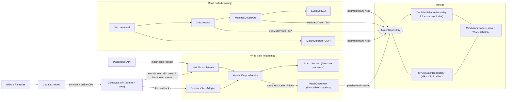
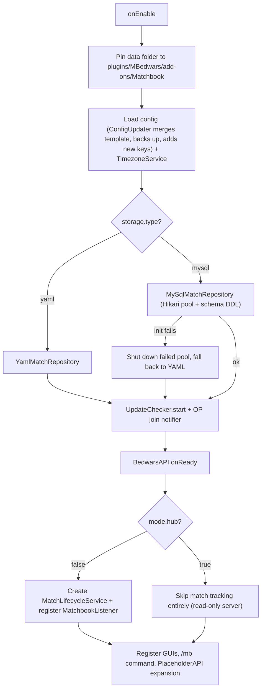
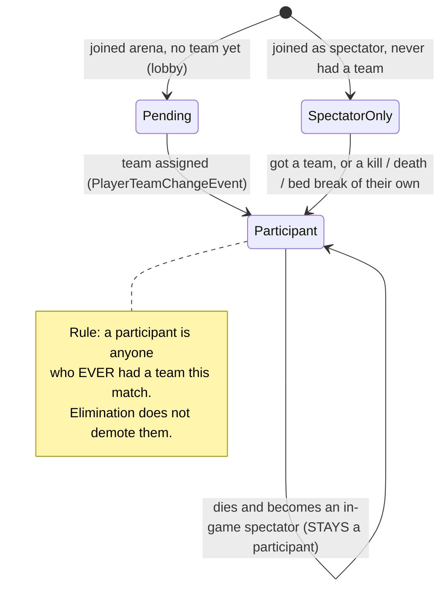
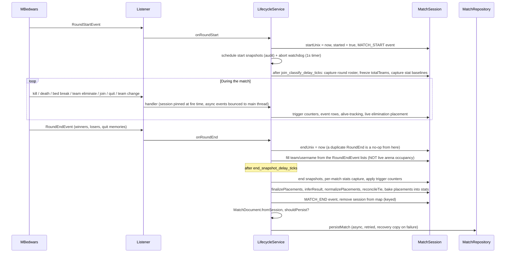
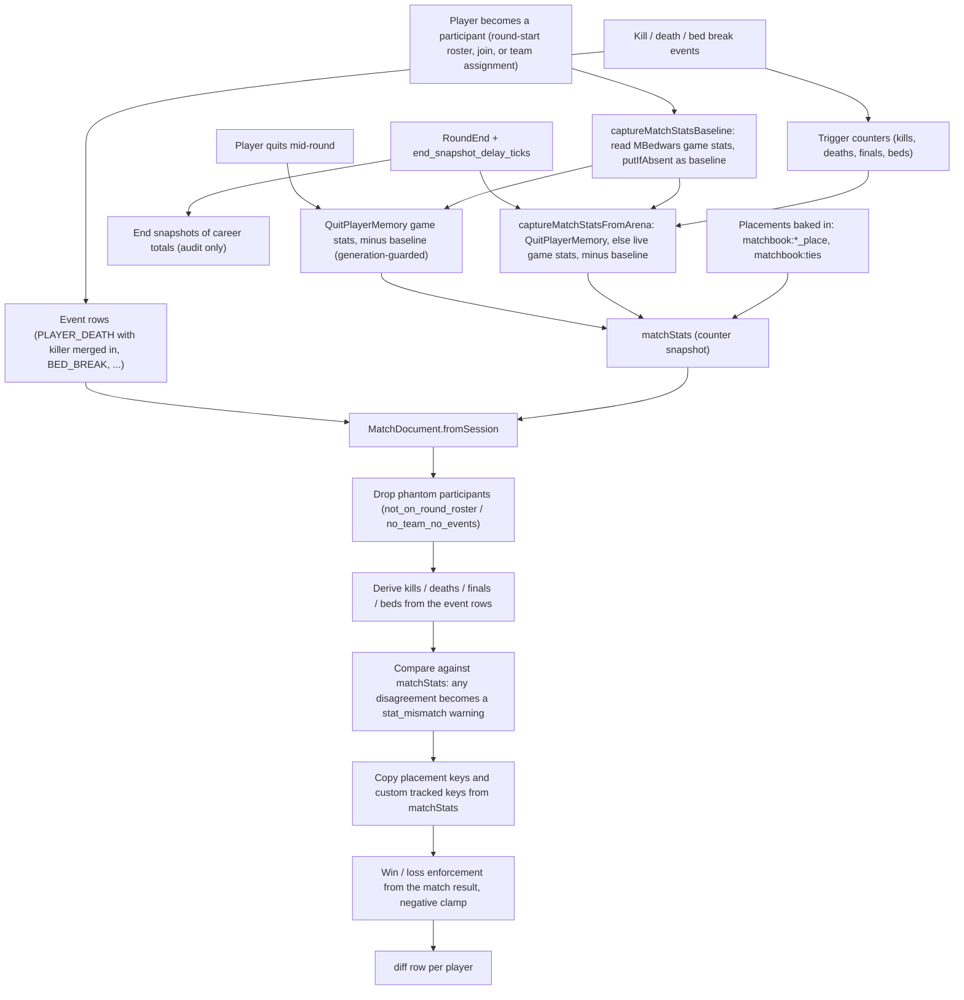
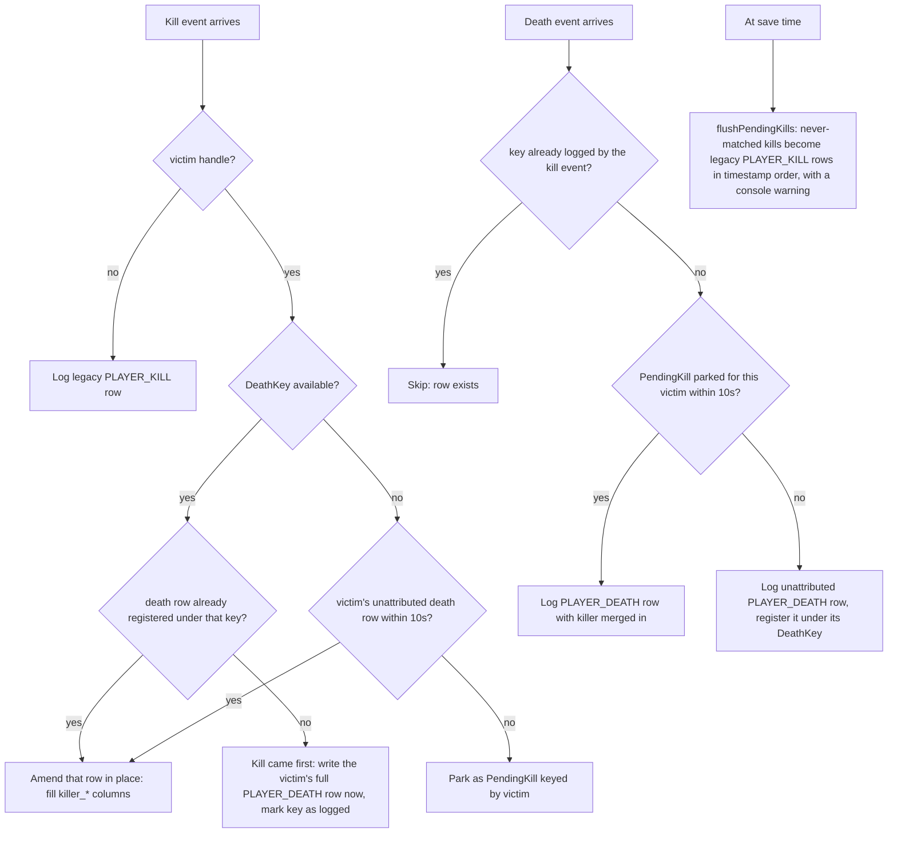
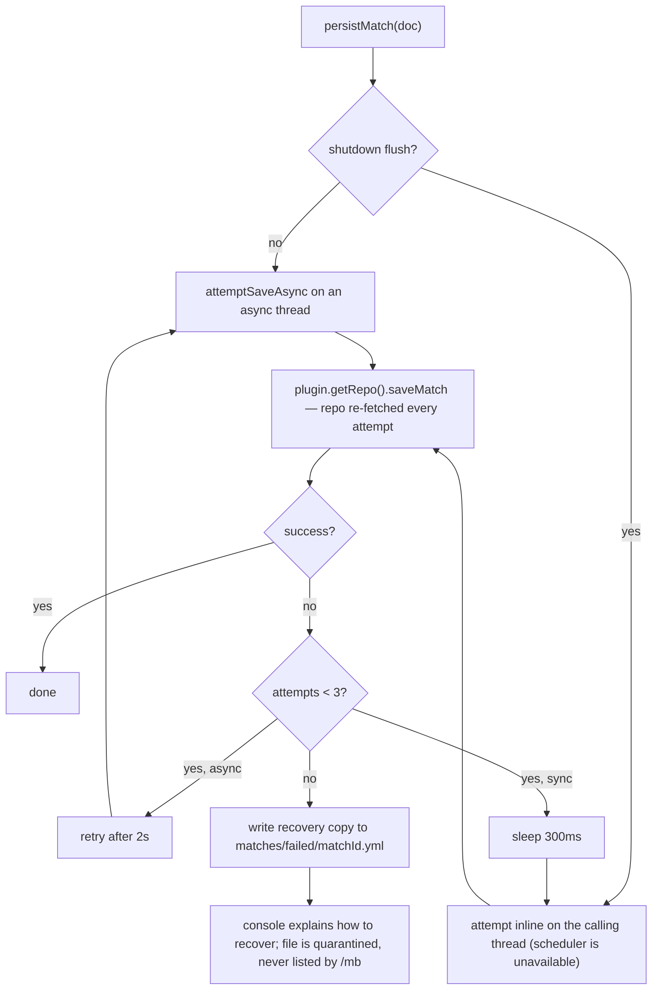
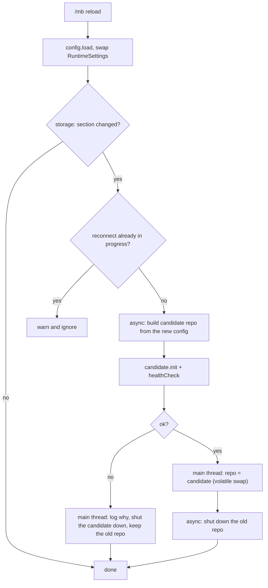

# Architecture & Internals

The developer manual for Matchbook: how it's built and how it works inside. It's written so the plugin can be understood without reading the code.

Looking for install instructions, commands or config? Those are in the [README](../README.md).

## Contents

1. [How it's built](#1-how-its-built)
2. [Project layout](#2-project-layout)
3. [High-level architecture](#3-high-level-architecture)
4. [Startup sequence](#4-startup-sequence)
5. [The match lifecycle (the core)](#5-the-match-lifecycle-the-core)
6. [The stats pipeline](#6-the-stats-pipeline)
7. [Placement & result resolution](#7-placement--result-resolution)
8. [The event log & kill/death merging](#8-the-event-log--killdeath-merging)
9. [Persistence layer](#9-persistence-layer)
10. [The match document schema](#10-the-match-document-schema)
11. [The GUIs](#11-the-guis)
12. [Commands & tab completion internals](#12-commands--tab-completion-internals)
13. [Supporting services](#13-supporting-services)
14. [Threading & reliability model](#14-threading--reliability-model)

---

## 1. How it's built

Matchbook is a single-module **Gradle** project targeting **Java 21** (via toolchain), built with the **Shadow plugin** so the final jar is self-contained.

| Dependency | Scope | Why |
|---|---|---|
| `io.papermc.paper:paper-api` 1.21.4 | `compileOnly` | Provided by the server at runtime |
| `de.marcely.bedwars:API` 5.5.6 | `compileOnly` | Provided by the MBedwars plugin (hard `depend`) |
| `me.clip:placeholderapi` 2.11.6 | `compileOnly` | Optional (`softdepend`); guarded by a plugin-presence check |
| `com.zaxxer:HikariCP` 5.1.0 | `implementation` | **Shaded** into the jar, connection pooling for MySQL |
| `com.mysql:mysql-connector-j` 9.0.0 | `implementation` | **Shaded** into the jar, JDBC driver |

Two deliberate build quirks:

- **The plain `jar` task is disabled.** It would produce a "thin" jar without HikariCP/mysql-connector (they're `implementation`-scoped, only shadowJar bundles them) that throws `NoClassDefFoundError` the moment MySQL storage is enabled. Worse, both tasks write to the same `build/libs/Matchbook-<version>.jar` (shadowJar's classifier is `""`), so leaving `jar` enabled was a race that could silently overwrite the working shaded jar with the broken thin one. `assemble`/`build` now only produce the shaded jar.
- **Dependencies are not relocated.** Relocation is deliberately off to avoid surprises with the JDBC service-provider (SPI) discovery mechanism.

There is no test source set in the repo; the "simulation harness" mentioned in the features list drives the compiled classes from outside this module.

## 2. Project layout

```
Matchbook/
├── build.gradle / settings.gradle / gradlew        ← Gradle build (Shadow plugin, Java 21)
├── src/main/resources/
│   ├── plugin.yml                                  ← Bukkit descriptor, commands, permission tree
│   └── config.yml                                  ← packaged config template (also the merge source
│                                                      for automatic config upgrades)
└── src/main/java/com/slg/matchbook/
    ├── MatchbookPlugin.java        ← JavaPlugin entry point; wiring, storage bootstrap, reload/hot-swap
    ├── MatchbookListener.java      ← bridges MBedwars events → MatchLifecycleService
    ├── MatchSession.java           ← all live state for one in-progress match
    ├── StatSnapshot.java           ← immutable map of stat key → value, with diff()
    ├── MatchStorage.java           ← YAML file writer (day folders, filenames, user index updates)
    ├── UserMatchIndex.java         ← per-player users/<uuid>.yml (history index + timezone, file-locked)
    ├── model/
    │   ├── MatchDocument.java      ← immutable, storage-ready snapshot of a finished match;
    │   │                              derives the stats rows from the event log
    │   └── MatchEvent.java         ← one timeline event (record + factory methods)
    ├── service/
    │   ├── MatchLifecycleService.java ← THE core: session lifecycle, stats capture, placements, saving
    │   ├── BedwarsStatsAdapter.java   ← normalizes MBedwars' stats object across API versions
    │   ├── TimezoneService.java       ← per-viewer display timezone (aliases, config default, overrides)
    │   └── UpdateChecker.java         ← GitHub release polling + operator alerts
    ├── storage/
    │   ├── MatchRepository.java       ← backend interface (save/load/list/health)
    │   ├── YamlMatchRepository.java   ← flat-file backend
    │   ├── MySqlMatchRepository.java  ← HikariCP/MySQL backend
    │   ├── MigrationService.java      ← yaml2mysql / mysql2yaml (with --dry-run)
    │   └── HealthCheckResult.java     ← ok/fail + message record
    ├── io/
    │   ├── MatchYamlCodec.java        ← single source of truth for the match YAML schema
    │   ├── MatchExporter.java         ← CSV export (stats + events, single & combined)
    │   └── HasteUploader.java         ← Hastebin-compatible upload client (currently disabled at call sites)
    ├── config/
    │   ├── MatchbookConfig.java       ← config loading + typed accessors
    │   ├── ConfigUpdater.java         ← template merge / comment restore / backups on upgrade
    │   ├── RuntimeSettings.java       ← immutable parsed settings, swapped atomically on reload
    │   └── StorageType.java           ← YAML | MYSQL
    ├── commands/
    │   └── MatchbookCommand.java      ← /mb executor + tab completer (async storage access)
    ├── gui/
    │   ├── MatchesGui.java            ← match list (history + all), 54-slot paginated
    │   ├── MatchesDetailsGui.java     ← per-match player breakdown
    │   ├── EventLogGui.java           ← per-match event timeline
    │   └── ReturnTarget.java          ← where a details GUI was opened from (for its Back button)
    ├── placeholders/
    │   └── MatchbookExpansion.java    ← %matchbook_matchcode% (PlaceholderAPI)
    └── util/
        ├── MatchIdUtil.java           ← random Crockford-Base32 match codes ("8F3KQ-2JDXW")
        └── StatsKeyDiscovery.java     ← reflective stat-key enumeration for /mb statskeys
```

A useful mental split: **recording** (listener → lifecycle → session → document → repository) is the write path; **browsing/exporting** (command → repository → GUI/exporter) is the read path. The two only meet at the `MatchRepository` interface and the YAML document schema.

## 3. High-level architecture

This is the whole plugin on one page, the write path across the top, the read path underneath, and the one seam (`MatchRepository`) where they meet:



Key architectural decisions:

- **One YAML schema everywhere.** `MatchYamlCodec` produces the match document; YAML mode writes it as a file, MySQL mode stores the *same YAML text* in a `LONGTEXT` column. The GUIs and exporter read a `YamlConfiguration` regardless of backend, so they contain zero storage branching, and migration between backends is a straight copy.
- **Sessions are decoupled from documents.** `MatchSession` is mutable, concurrent, and full of live MBedwars object references. `MatchDocument` is an immutable snapshot with no live references, safe to serialize on any thread.
- **The listener is thin.** `MatchbookListener` only translates MBedwars events into lifecycle calls (plus main-thread bouncing for async events); every decision lives in `MatchLifecycleService`.
- **The placeholder goes through the listener,** not the repository, `%matchbook_matchcode%` asks the lifecycle for the arena's live session (creating one early if needed), which is why it's empty on a hub server where no listener exists.

## 4. Startup sequence

`onEnable` does the storage bootstrap first, then defers everything that touches MBedwars until MBedwars says it's ready:



Notable details:

- **The data folder is hard-pinned** to `plugins/MBedwars/add-ons/Matchbook` (resolved from the server's plugins folder) rather than the default per-plugin folder, Matchbook lives as an MBedwars add-on.
- **Almost everything waits for `BedwarsAPI.onReady`** so MBedwars is fully initialized before listeners and GUIs exist. The only things registered unconditionally are the update checker and its join-notification listener (they must work in hub mode too).
- **Storage init is failure-tolerant:** if MySQL init throws, the half-built pool is explicitly shut down (so it can't leak connections) and Matchbook falls back to YAML rather than disabling itself. If the YAML fallback fails as well, that's logged loudly instead of swallowed.
- **Shutdown (`onDisable`)** flushes all in-progress sessions *synchronously* before closing the repository, Bukkit refuses new async tasks once a plugin is marked disabled, so the async save path would silently drop matches at that point.

## 5. The match lifecycle (the core)

`MatchLifecycleService` owns a map of **one live `MatchSession` per arena name** (`sessionsByArena`). The session is where every piece of live match state accumulates: participants, teams, alive-tracking, stat baselines, counters, and the event log.

### Session creation & identity

- A session can be created **early** (first player joins the arena lobby, or a placeholder resolves) so `%matchbook_matchcode%` is stable before the round starts. Its `startUnix` is overwritten when `RoundStartEvent` actually fires; `started=true` from then on gates event logging (no lobby join/leave noise).
- Match codes come from `MatchIdUtil`: two 5-character groups of Crockford Base32 (no I/L/O/U) from `SecureRandom`, e.g. `8F3KQ-2JDXW`, a 32¹⁰ (~10¹⁵) space. IDs are random and never checked for uniqueness at allocation; the MySQL backend has a collision guard as backstop (§9).
- `liveSessionOrNew()` never returns a session whose `endUnix` is set, an ended session still waiting on its save chain is evicted and a fresh one created, so a fast next round on the same arena can't get merged into the previous match.
- `isLocallyHosted()` rejects arenas with no loaded game world on this server, MBedwars' proxy-wide "remote arena" awareness would otherwise let a hub server create phantom sessions for matches actually played elsewhere.

### Player classification

Every player in an arena is in exactly one of three states per match, and the transitions matter because only **participants** get stats and appear in the record:



Classification at join time is **deferred by `join_classify_delay_ticks`** (default 60): MBedwars can report stale team/spectator state in the seconds right after a round starts, which would misclassify a real player as a spectator or vice versa. The `SpectatorJoinArenaEvent` reason is also used: `LOSE`/`DEATH` mean an eliminated *participant* became an in-game spectator (ignored), anything else is an external viewer (marked spectator-only).

**Who actually played this round** is tracked separately from "who is a participant", in `roundRoster`: the roster observed shortly after round start, plus anyone who joined or was assigned a team *while the round was running*. Round-**end** roster entries don't count, `RoundEndEvent`'s winner/loser lists, and above all their `QuitPlayerMemory` buckets, are MBedwars' after-the-fact account, and a memory left behind by an *earlier* round on the same arena arrives carrying its own team assignment. Those entries are still used to fill in team/username for players already known (the only source of a team for someone who left mid-round), but a participant on neither the round roster nor anywhere in the event log is dropped at document-build time, see section 6.

### Life of a match

Here's one round from `RoundStartEvent` to the save, with the delays and the async hops that make the guards below necessary:



Three details here are load-bearing:

- **Session pinning.** MBedwars can fire kills/deaths/bed breaks asynchronously; the listener must bounce them to the main thread, which lands a tick later. The listener therefore *pins* the live session at the moment the event fires (`pinLiveSession`). Without this, the match-deciding final kill would re-resolve the session after `RoundEnd` already stamped `endUnix` and be silently discarded.
- **The round-end roster comes from `RoundEndEvent`,** not `arena.getPlayers()`. Live occupancy can already include players queued into the arena's *next* round; the event's winner/loser lists (plus `QuitPlayerMemory` for players who left) are exactly who played *this* round, subject to the round-roster check above.
- **The ended-session guard.** Once `endUnix` is set, `liveSession()` returns null for that arena, straggler events during the multi-second save chain belong to whatever comes next, not the closing match.

### Abort & flush paths

A 1-second watchdog per match handles the cases where `RoundEnd` never arrives:

- **Stuck match:** running longer than `match.max_duration_minutes` (default 180) with no round end → **discarded**, never saved. This is the fix for the historical "duplicate match with an absurd running time" bug (a lingering session being flushed at server shutdown with a start time from hours earlier).
- **Aborted match:** arena leaves `RUNNING` without a `RoundEnd` → best-effort stats capture, saved with result `ABORTED` (only if it has real activity).
- **Plugin disable:** `flushAll(sync=true)` saves every remaining session synchronously (result `ABORTED` unless already determined). The same max-duration check applies at persist time as a second line of defense, and negative durations are always rejected.

A match is **only persisted at all** if it has real activity: at least one kill, final kill, death, final death, or bed break (event-driven flag first, document inspection as fallback).

## 6. The stats pipeline

**Since 0.7.5 the recorded event log is the source of truth for exported stats.** MBedwars' counters are still read, baselined when a player joins, captured again when they leave or the round ends, but only to cross-check the event-derived numbers and to fill custom keys the event log knows nothing about. Here's how the two streams come together into one `diff` row per player:



At document-build time (`MatchDocument.fromSession`) each player's stats row is derived from the match's own event rows:

| Stat | Derived from |
|---|---|
| `bedwars:deaths` / `bedwars:final_deaths` | The player's `PLAYER_DEATH` rows (skipping rows MBedwars flagged as not stat-counting, stored as `stats_uncounted` on the row; the row itself stays in the log). |
| `bedwars:kills` / `bedwars:final_kills` | `PLAYER_DEATH` rows attributing the death to the player, plus legacy standalone `PLAYER_KILL` rows. |
| `bedwars:beds_destroyed` | The player's `BED_BREAK` rows. |
| `bedwars:beds_lost` | `BED_BREAK` rows whose `bed_team` is the player's team. |
| `bedwars:wins` / `bedwars:loses`, `matchbook:*_place`, `matchbook:ties` | The finalized result/placements (section 7). |

Every derived key is explicitly present (zeroed) in every row, so stats are always baselined to 0.

Two kinds of roster artifact are dropped from the document entirely, each with a `phantom_participant_dropped` warning naming which rule caught it:

| Rule | What it catches |
|---|---|
| `not_on_round_roster` | Someone who was neither on this round's roster (section 5) nor mentioned anywhere in the event log, whatever team came attached to them. This is the stale round-end roster entry: a `QuitPlayerMemory` from an earlier round on the same arena, bucketed into this round's winners/losers by the team it still carries, which showed up as an extra member of whichever team matched (typically the winning one). Skipped entirely for a session that never captured a round roster, where every participant would look unconfirmed. |
| `no_team_no_events` | A teamless participant the event log never mentions, e.g. a player queueing into this arena's next round while this one was ending. |

MBedwars' counters are still captured, but demoted to supporting roles:

| Source | Role today |
|---|---|
| **Per-round "game stats"** (`QuitPlayerMemory.getGameStats()` at quit, or live game stats at round end), baseline-diffed and generation-guarded | Diagnostic cross-check: any disagreement with the event-derived value is recorded as a `stat_mismatch` warning in the match document. Also the only source for **custom tracked keys** the event log can't derive. |
| **Event-driven trigger counters** (`bedwars:kills`, `final_kills`, `deaths`, `final_deaths`, `beds_destroyed`) | Persistence trigger, and folded into the cross-check snapshot (`applyTriggerIncrementsToMatchStats`). |
| **Start/end snapshots of career totals** for every tracked key | Audit trail (stored as `start`/`end` in the document). |

The baseline (`putMatchStatsBaselineIfAbsent`) and generation-counter (`removeMatchStats`) guards on the game-stats capture still apply: the baseline is what makes a per-round counter MBedwars didn't reset read as 0 for this match, and the generation stamp is what stops a quit-time snapshot that lands *after* a rejoin from freezing the player's stats at quit-time values. They now protect the cross-check rather than the exported data. Snapshot collection itself is callback-based (MBedwars stats API is async) with a countdown latch and a **timeout** (`snapshot_timeout_ticks`): a player whose callback never arrives can delay the save, not block it.

Also at document-build time:

- Negative values on snapshot-sourced keys are clamped to 0 and recorded in `match.warnings` (they indicate MBedwars reset a counter mid-match). Event-derived values can't go negative.
- **Win/loss enforcement** (`enforce_win_loss_from_result`): winners get `wins=1, loses=0`; everyone else `loses=1, wins=0`, from the *match result*, not from whenever MBedwars happened to increment its counters. Tied-for-1st teams get neither (plus `matchbook:ties=1`); in a multi-team match that ended in a tie, teams eliminated earlier still get a loss. A team that finished 1st is never stamped with a loss, even on the abort/flush paths that build a document without a finalized result.

## 7. Placement & result resolution

Placements (1st/2nd/3rd…) are tracked **live** and then repaired at round end by a pipeline of correctors, each handling a specific MBedwars quirk:

**Live tracking during the match**

- `alivePlayersByTeam` tracks who's alive; fatal deaths, quits, and team switches remove players (a switch also re-checks the *old* team for elimination so no "ghost" entry blocks it forever).
- A team is eliminated when its **bed is gone AND all players are dead** (`maybeMarkTeamEliminated`); `TeamEliminateEvent` from MBedwars is the authoritative direct signal. Eliminated teams get a place computed as `totalTeams − eliminationIndex + 1`, floored at 2 (an eliminated team can never be given 1st).
- `totalTeams` is **frozen once** from the roster observed shortly after round start, counting only teams that actually have players, so a lobby-selector team someone abandoned before the round can't inflate the denominator and shift every placement.

**Round-end pipeline (in order, each step feeding the next):**

1. `finalizePlacements`: infer missed bed states via reflection, **drop teams nobody finished on**, detect ties (see below), stamp winner as 1st, fill eliminations that were missed live, and assign conservative fallback ranks to ambiguous teams (never falsely rewarding them, never colliding on the same rank).
2. `inferResultFromRecordedWinStats`: some MBedwars builds fire the winning-team event with `null` winner; infer from which team's players have `bedwars:wins` in their per-match stats. Can convert a false TIE into a definitive win (or a real multi-team tie). Stands down for a survivor tie (below), which it would otherwise undo.
3. `normalizePlacements`: collapse to a **contiguous 1..N competition ranking** (order-preserving; genuine ties share a rank, e.g. 1,1,3). This is the backstop that makes standings correct even if the arithmetic drifted, the guarantee behind "never 1st/3rd/4th with no 2nd".
4. `reconcileTieWithPlacements`: a "TIE" whose standings show exactly *one* team at 1st wasn't a tie; promote it to a win (logged).
5. `applyPlacementsToMatchStats`: bake one-hot keys into each participant's stats: `matchbook:1st_place`, `matchbook:2nd_place`, … or `matchbook:ties` for tied-for-1st teams. This makes multi-match CSV aggregation work by plain summation.

**Ties between surviving teams**

More than one team still standing when the round ends means nobody was played out of the match: it hit the time limit, or was force-ended, with every survivor still in it. Those teams are recorded as **tied for 1st**, and teams eliminated earlier keep the placement they earned.

MBedwars may still announce a winning team in that situation, some setups break a time-limit end with their own tiebreak (most beds destroyed, most kills). That is a decision about who to *reward*, not a record of the match having been won, and taking it at face value turned a three-way tie into "1st, 2nd, 2nd": the announced team was stamped 1st and the other two survivors dropped to runner-up. Survivors win that disagreement by default; set **`match.multiple_survivors_are_a_tie: false`** to record MBedwars' winner instead.

The override is deliberately one-sided: it only applies when the announced winner is *itself* one of the surviving teams. If MBedwars names a winner Matchbook doesn't even have alive, the alive-tracking is the unreliable side and the announced winner stands.

The final result string is one of `WIN:<TEAM>`, `TIE`, `ABORTED`, or `UNKNOWN`.

## 8. The event log & kill/death merging

Every discrete happening is appended to the session's event list as a `MatchEvent` record (type, unix timestamp, and per-type fields). Types: `MATCH_START`, `PLAYER_JOIN`, `PLAYER_LEAVE` (with a `was_spectating` flag read *before* the leave marks them dead), `PLAYER_DEATH`, `PLAYER_KILL` (legacy), `BED_BREAK`, `TEAM_ELIMINATE`, `SPECTATOR_JOIN`, `SPECTATOR_LEAVE`, `MATCH_END`.

The interesting machinery is **kill/death merging**. MBedwars fires the victim's death event (`PlayerIngameDeathEvent`) and the killer's kill event (`PlayerKillPlayerEvent`) *separately and in no guaranteed order*, sometimes on different threads. Matchbook wants one row per death, with the killer's attribution on it. Both events wrap the same Bukkit `PlayerDeathEvent`, so since 0.7.4 the two halves are matched by that object's identity (`DeathKey` = victim UUID + identity hash), exact and order-independent; the older victim-plus-time heuristic survives only as a fallback:



The 10-second window still bounds the identity match and the fallback path, generous enough that scheduler lag can't split a pair, small enough that an attribution can never bleed into the victim's *next* respawn death. If the identity pairing ever misses and the fallback catches it instead, a one-time console warning says so, because it means MBedwars fired the two events around different Bukkit events. The `final` flag is OR-ed across both sides. Death cause (`FALL`, `VOID`, …) comes from the wrapped Bukkit death event's last damage cause; kill cause records how the killer contributed, together they encode "Alex fell into the void after being punched by Steve".

Serialization bakes in an `offset` (seconds from match start; negative = lobby) so old files remain self-contained.

## 9. Persistence layer

`MatchRepository` is the seam between recording/browsing and storage:

```java
void init(); void shutdown();
void saveMatch(MatchDocument doc);
YamlConfiguration loadMatchYaml(String matchId);   // both backends return the same shape
List<String> listMatchIdsForPlayer(UUID);          // newest first
List<String> listAllMatchIds();                    // newest first
HealthCheckResult healthCheck();                   // for /mb test and reload validation
```

### YAML backend

- Files land in `matches/<MM-dd-yyyy>/<startUnix>-<md5(arena)>-<matchId>.yml`. The matchId in the filename exists purely to prevent same-second collisions, **nothing parses filenames**; lookups read `match.match_id` from file contents (which is why `findMatchFileById` is a full scan, and why every GUI/command path that triggers it runs async).
- A write failure **throws** rather than being logged and swallowed, that's what lets the retry/recovery net below engage on the default backend too.
- After each save, every participant's `users/<uuid>.yml` index is updated (match id list, newest first, capped at 500, plus an id→relative-path map). Index updates are **best-effort** and outside the save's success contract, the match file is already safely on disk. Per-player file locks serialize concurrent index writes from two matches ending at once.
- `matches/failed/` is **quarantine** for recovery copies (below) and is explicitly excluded from listing/lookup.

### MySQL backend

Two tables (prefix configurable, default `matchbook_`):

```
matchbook_matches         match_id PK, start_unix, end_unix, arena, result,
                          yaml LONGTEXT  ← the full match document, same text as YAML mode
matchbook_player_matches  (player_uuid, match_id) PK, username, team,
                          FK → matches ON DELETE CASCADE
```

- HikariCP pool with config-driven sizing (`storage.mysql.pool.*`). Saves are transactional upserts (match row + batched player-index rows), with explicit rollback and autocommit restore on failure.
- **ID-collision guard:** before upserting, the repo checks whether the match id already belongs to a *different* match (different start_unix+arena). If so it refuses, the save fails into the retry/recovery path instead of silently overwriting a stored match. Re-saving the *same* match (retry, migration re-run) passes.
- Schema self-heals: `CREATE TABLE IF NOT EXISTS` plus an `INFORMATION_SCHEMA` check that widens `match_id` columns from older installs. `init(false)` skips the DDL entirely, used by migration dry runs.

### Save retry & recovery

Every save, normal finish, abort, and shutdown flush, goes through `persistMatch`, which never throws and never loses the document:



`plugin.getRepo()` is re-fetched on **every** attempt, so a retry can succeed against a backend an admin just fixed with `/mb reload`.

### Hot-swapping storage on reload

`/mb reload` compares a fingerprint of the `storage:` config section before and after; only a real change triggers a reconnect, and a bad one can never take down the backend that's already working:



In-flight saves are unaffected in either direction: a retry picks up whichever repo is current at that moment, and the old backend is only shut down after nothing new can reach it.

### Migration

`MigrationService` runs either direction as a batch (async, one at a time via an `AtomicBoolean` lock): YAML→MySQL reads every match file and upserts its raw text; MySQL→YAML writes files back into day folders and rebuilds user indexes. `--dry-run` counts without writing, and deliberately skips schema DDL, so previewing can't mutate the database. Per-record failures are logged and skipped rather than aborting the batch; filenames derived from DB content are sanitized so a tampered shared database can't inject path separators.

## 10. The match document schema

The YAML document written by `MatchYamlCodec` (identical on disk and in the DB):

```yaml
match:
  match_id: "8F3KQ-2JDXW"
  start_unix: 1751297443
  end_unix: 1751298012
  arena: "Lighthouse"
  result: "WIN:RED"            # WIN:<TEAM> | TIE | ABORTED | UNKNOWN
  matchbook_version: "0.7.7"   # version that RECORDED the match
  start_snapshot_taken_unix: 1751297444
  tied_teams: [RED, BLUE]      # only present on ties
  participants: [<uuid>, ...]  # everyone who ever had a team (minus dropped phantoms)
  spectators: [<uuid>, ...]    # watch-only viewers, never on a team
  warnings: ["stat_mismatch <uuid> bedwars:kills events=4 counters=5", ...]   # optional

spectators:
  <uuid>: { username: "Watcher1" }

players:
  <uuid>:
    username: "Steve"
    team: "RED"
    team_color: "RED"          # the arena's actual DyeColor at save time,
                               # so the GUI stays correct if an admin recolors teams
    start_taken_unix: 1751297444
    start: { bedwars:kills: 120, ... }   # career totals at match start (audit)
    end:   { bedwars:kills: 124, ... }   # career totals at match end (audit)
    diff:  { bedwars:kills: 4,           # ← THE match stats (what GUIs/exports read)
             bedwars:wins: 1,
             matchbook:1st_place: 1 }

events:
  - { type: MATCH_START, timestamp: 1751297443, offset: 0 }
  - { type: PLAYER_DEATH, timestamp: 1751297501, offset: 58,
      player_uuid: ..., player_name: Alex, player_team: BLUE,
      killer_uuid: ..., killer_name: Steve, killer_team: RED,
      final: true, cause: VOID, kill_cause: ENTITY_ATTACK }
  # null/false/absent fields are simply omitted per event
```

The `diff` map is the authoritative per-match stat set (despite the name it's derived from the event log, not a literal diff, see §6). `start`/`end` are kept for auditing.

## 11. The GUIs

All three GUIs share the same construction pattern:

1. **All storage reads happen async** (repo scans/queries can block), building `ItemStack`s off-thread, including the viewer's timezone lookup, which may read `users/<uuid>.yml` on first use.
2. Hop back to the main thread to create and open the inventory (checking the viewer is still online).
3. Each inventory has a custom `InventoryHolder` carrying the viewer, target, page and, for details/event log, the `ReturnTarget` it was opened from; that's how click handlers identify "our" inventories and page state without any global map. All clicks/drags into the GUI are cancelled.
4. Buttons carry identity via `PersistentDataContainer` (e.g. the match id on each match item), never by parsing display names.

Layouts (all 6×9 = 54 slots, bottom row = nav bar with prev `45` / back-close `49` / next `53`):

| GUI | Content slots | Specifics |
|---|---|---|
| `MatchesGui` (history & all) | 0–44 (45/page) | Item = wool of the winning team's color (yellow for ties, paper for ABORTED/UNKNOWN "PLAYED"); lore shows arena, date, length, player count, your team, and (history view only) your stats. Handles legacy path-style index entries. |
| `MatchesDetailsGui` | header slot 4, players 9–44 (36/page) | Players grouped by fixed team order, then final kills → kills. Each player is a wool block in their team's **persisted** bed color. Spectators item at 47, event log button at 51. Back goes to the `ReturnTarget` (history or all-matches, same page), or the viewer's own history when opened via `/mb view`. |
| `EventLogGui` | 0–44 (45/page) | One item per event with type-specific icon/description; time shown as `+M:SS` from match start (`lobby` for pre-round). Back returns to the details page it was opened from, carrying the original `ReturnTarget` along. |

Team colors resolve from the persisted `team_color` field first, then a name→dye fallback table for pre-field matches, so admin-recolored teams display correctly forever. Dates and times are formatted through `TimezoneService.zoneFor(viewer)`.

## 12. Commands & tab completion internals

`MatchbookCommand` is a single executor + tab completer with a two-tier permission check (`mb.command.default`/`mb.command.admin` group nodes OR the specific node, plus legacy `matchbook.*` acceptance).

The non-obvious parts are all about keeping the main thread free:

- **Every storage-touching subcommand runs async**: `view` validates existence off-thread before opening the GUI, `export` and `migrate` do all their work off-thread and bounce messages back, and `timezone` reads/writes the player's `users/<uuid>.yml` off-thread too.
- **Tab completion is served from a cache.** Completion fires on every keystroke on the main thread, but building candidates hits storage (in YAML mode, `listAllMatchIds()` parses every match file). The completer returns the last cached list instantly and kicks off a background refresh when older than 30s, deduped by an in-flight set and capped at 50 ids / 200 senders.
- `export` completion understands comma-separated lists: it completes only the last segment and re-prefixes suggestions with the codes already typed, skipping duplicates.
- One migration at a time (`AtomicBoolean`); overlapping runs would interleave writes and double-count totals.
- The Hastebin upload path (`export_upload.*`, `HasteUploader`) is fully implemented but currently **disabled at its call sites**; the config keys remain for when it returns.

## 13. Supporting services

**PlaceholderAPI (`MatchbookExpansion` + lifecycle cache).** `%matchbook_matchcode%` (and legacy spellings `match_code`/`match_id`/`matchid`) resolves the player's arena → live session id. Because scoreboards keep rendering through the end screen, every meaningful touchpoint also writes a per-player **grace cache** (`placeholder.grace_seconds`, default 60s) that keeps returning the last match code after the session is gone. The cache self-purges past 512 entries.

**Timezones (`TimezoneService`).** Resolution order is the player's own override (stored as `timezone` in `users/<uuid>.yml`) → `display.timezone` → the machine's zone. Friendly US names and abbreviations map to real IANA zones (`est` → `America/New_York`), so daylight saving stays right year-round instead of pinning a fixed offset. Overrides are cached in memory per player after the first disk read; an invalid `display.timezone` is warned about once and falls back to the server zone.

**Update checker.** Polls the GitHub Releases API (initial check ~5s after boot, then every `update_check.interval_hours`), compares semantic versions (pre-release suffixes stripped), and alerts console + online OPs once per discovered version; OPs who log in later are caught up by a join listener that works even in hub mode.

**Config system.** `MatchbookConfig` exposes typed accessors and builds an immutable `RuntimeSettings` record (tracked keys, clamped timing values, export columns) that is **atomically swapped** on reload, no torn reads mid-match. `ConfigUpdater` syncs the on-disk config against the packaged template on *every* load: missing keys are filled from defaults, comments are always restored from the template (so wording fixes reach existing installs), user-added extra keys survive, and the file is only rewritten, with a timestamped backup, when something actually drifted.

**CSV exporter.** Reads match YAML through the repo (backend-agnostic). Column set = configured `export.columns` or smart defaults (uuid, username, team + tracked keys), with `matchbook:*_place` columns auto-discovered from the exported matches and `matchbook:ties` always present so multi-file spreadsheets line up. Multi-match stat exports aggregate by UUID (stats summed, team becomes `MIXED` when it varies); event exports merge and sort chronologically with a `match` column. Cells are escaped **and formula-injection-proofed** (leading `=+-@` gets a quote prefix).

**Stat key discovery (`/mb statskeys`).** MBedwars doesn't reliably expose a key-enumeration API, so `StatsKeyDiscovery` tries a series of method names reflectively, then Map-typed fields, to list whatever keys exist for a player, feeding the `match.tracked_keys` config.

**Reflection as a compatibility strategy.** MBedwars' API surface varies across builds, so several helpers try direct API calls first and reflect as a fallback: bed-state checks (`isBedDestroyed`/`hasBed`/…), team-alive checks, spectator checks, game-stats extraction (`BedwarsStatsAdapter`). Everything is wrapped in `catch (Throwable)` with conservative defaults, an API mismatch degrades a heuristic instead of throwing in an event handler.

## 14. Threading & reliability model

Bukkit rule of thumb applied throughout: **game state on the main thread, I/O off it.**

| Runs on main thread | Runs async |
|---|---|
| All event handling & session mutation (async MBedwars events are bounced over with a pinned session) | All storage reads/writes (saves, GUI loads, listing, export, migration, timezone files) |
| Inventory creation/opening | MBedwars stat callbacks (arrive on their own threads; `MatchSession` is built from concurrent collections for exactly this reason) |
| Placement finalization scheduling, storage swap commit | Update check HTTP, storage reconnect validation |

The defensive guards, collected in one place, most exist because a specific real-world failure was observed:

| Guard | Protects against |
|---|---|
| `pinLiveSession` at event time | The match-winning final kill being dropped (or attributed to the next round) after a main-thread bounce |
| `liveSessionOrNew` evicting ended sessions | Two back-to-back rounds on one arena merging into one document |
| Keyed `sessionsByArena.remove(name, session)` | An async finalize deleting the *next* round's session |
| `endUnix` dedupe in `onRoundEnd` | Duplicate RoundEnd events double-saving and double-stamping placements |
| Roster from `RoundEndEvent` + round-roster check at document build | Players queued for the next round, or a stale `QuitPlayerMemory` from an earlier round, leaking into the match |
| Event-derived stats with counter cross-check | Unreset MBedwars counters exporting stats the event log can't back up |
| Stat baselines (`putIfAbsent`) | MBedwars' unreset per-round counters attributing a previous round's stats to the cross-check |
| Generation counters on quit snapshots | A rejoin racing an async quit-snapshot and freezing a player's stats |
| Identity-keyed kill/death pairing | A second kill on the same victim overwriting an unmatched first attribution, or a fast respawn merging a kill into the wrong death |
| Watchdog + max-duration checks (live and at persist) | Stuck sessions saved at shutdown as absurd-duration "duplicate" matches |
| `isLocallyHosted` | Hub servers tracking remote/proxied arenas that never end |
| Synchronous `flushAll` in `onDisable` | The scheduler rejecting async saves during shutdown and dropping matches |
| Save retry → `matches/failed/` quarantine | Transient storage outages losing matches; failed records masquerading as saved ones |
| MySQL id-collision refusal | A random match-id collision silently overwriting a stored match |
| Validate-before-swap storage reload | A config typo taking down a working backend |
| Per-player file locks in `UserMatchIndex` | Two simultaneous match-ends losing an index entry via read-modify-write races |
| Snapshot timeouts | One missing stats callback stalling the whole save chain |

---

[Back to the README](../README.md)
